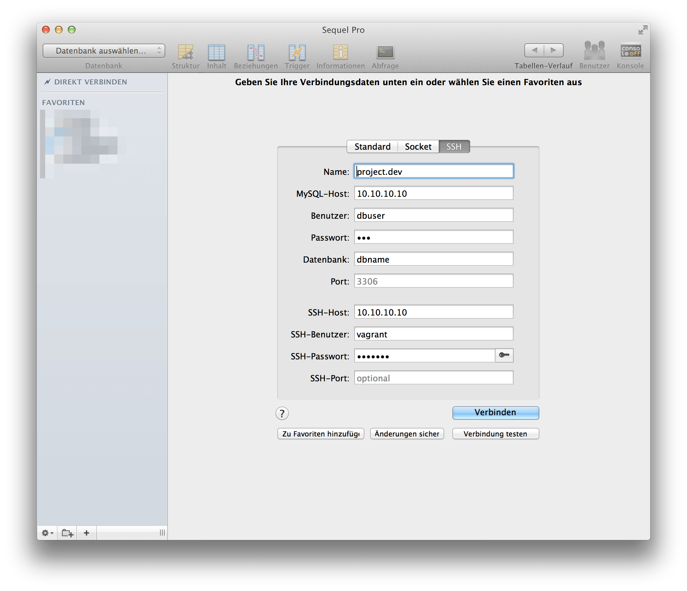

**Update**: With Version 4.2 Laravel introduced *Homestead*. A Vagrant-Box to use Laravel right out of the box. If the tutorial below is to difficult to you, give [Homestead](http://laravel.com/docs/homestead) a try.

I'm pretty new to [Laravel](http://laravel.com) and I just started to work on a new webapp (soon more) where I want to use Laravel in connection with [Vagrant](http://vagrantup.com).

Since I didn't found a proper solution that worked for me, here is my little tutorial.

*Note: At the time of writting this guide, I used Vagrant 1.4.3 and Mac OS X 10.9.2.*

### PuPHPet
Head over to [PuPHPet](https://puphpet.com) and configure your server like so:

**Deploy Target**

Remember `Local VM IP Address`. We need this later.

**Webserver**

Set `Server Name`to a URL you want to work with. Change `Document Root`to `/var/www/your-project-name/public`.

**MySQL**

Just remember the credentials. We need them later.

All set? Then hit the download button.

### Setup Vagrant
*I assume you have Vagrant alredy installed. If not, head over to their website and follow their [Get Started Guide](http://www.vagrantup.com/).*

So you unpacked your PuPHPet-Files and moved them into your local development folder? Great. Next we should edit the `Vagrant`-File.
I stumbled upon a permission error, when I used Laravel with Vagrant and searched through Stackoverflow and many forums, and the following changes should fix the problem:

Replace
`config.vm.synced_folder "#{folder['source']}", "#{folder['target']}", id: "#{folder['id']}", type: nfs`

with
`config.vm.synced_folder "#{folder['source']}", "#{folder['target']}", id: "#{folder['id']}", type: nfs, :mount_options => ["dmode=777","fmode=666"]`

(You find an example file [here](https://gist.github.com/stefanzweifel/9722708) ).
Save the file and open a terminal window and `cd` into your development folder.

- Initialize Vagrant with `vagrant up`. This may take some minutes

- SSH into VM with `vagrant ssh`
- `cd /var/www`
- Install Laravel with `composer create-project laravel/laravel your-project-name --prefer-dist`. This may also take some minutes to download.
- `exit`

Next we need to adjust our `hosts`-File. Open your Hosts-File via `sudo nano /etc/hosts/`and enter your previously entered IP-address and server name. In my example I used `10.10.10.10 project.dev`.

If your'e done, open your browser and head to `http://project.dev`.

If you don't see anything, try this in your terminal:
`chmod -R 777 your-project-name/app/storage`.

###Sequel Pro Settings
PhpMyAdmin is ugly as hell and I don't like it anymore. So I use [Sequel Pro](http://www.sequelpro.com/). These are the credentials I use to connect to my VM.

>MySQL-Host: `10.10.10.10` (or IP that you choose for it)
Username: `dbuser` (or username you created)
Password: `123` (or your choosen MySQL Password)

>SSH Host: `10.10.10.10` (or IP that you choose for it)
SSH User: `vagrant` (vagrants default username)
SSH Pasword: `vagrant` (vagrants default password)

### Outro
I hope this little guide helps you with setting up Laravel with Vagrant. If you have any problems, found a typo let me [know](http://twitter.com/_stefanzweifel).