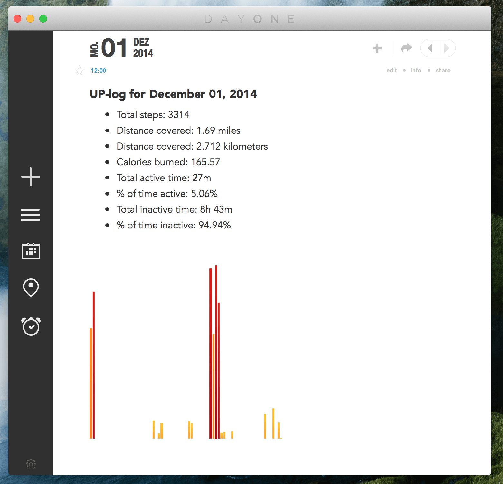

Since August I wear a [Jawbone UP 24](https://jawbone.com/up). The app and the  ecosystem is great, but I would also like to export a daily log to my [Dayone-Journal](http://dayoneapp.com).

Sadly there is no IFTTT-Channel for DayOne, but the guys from DayOne offer a CLI. So I created a script, which imports text-files into to my Day One Journal.

Maybe you can use it too.

<figure>
    
    <figcaption>Thanks to Markdown Support in Dayone, your UP Logs will loke like this.</figcaption>
</figure>

## What you need

- [DayOne.app](http://dayoneapp.com)
- [DayOne CLI](http://dayoneapp.com/downloads/dayone-cli.pkg)
- [Dropbox Account](http://dropbox.com)
- [IFTTT Account](http://ifttt.com)
- Jawbone UP (connected with IFTTT)

## What you have to do

- Grab the [DayOne CLI](http://dayoneapp.com/downloads/dayone-cli.pkg) and install it.
- Set up [Dropbox](https://ifttt.com/dropbox) and [Jawbone UP](https://ifttt.com/jawbone_up) IFTTT channels.
- Install the following IFTTT recipe and choose a path to store the logs. (This tutorial follows the default path)

<a href="https://ifttt.com/view_embed_recipe/224961-daily-up-log-to-dropbox" target = "_blank" class="embed_recipe embed_recipe-l_23" id= "embed_recipe-224961"></a><script async type="text/javascript" src= "//ifttt.com/assets/embed_recipe.js"></script>

- Download my script from this [Github Repository](https://github.com/stefanzweifel/up-to-dayone/releases/tag/v.1.1.0). If you like the terminal, you can also `git clone https://github.com/stefanzweifel/up-to-dayone`.
- Move the script into your Dropbox folder which was generated by IFTTT (For Example `Dropbox/Apps/up-export/up-logs/`).
- Use your UP for a day and check back tomorrow. IFTTT puts files into your Dropbox. Your folder structure should look similiar to this:

<figure>
    <a href="images/example-structure.png" target="blank">
          
    </a>
    <figcaption>This is my personal folder structure. Click on the image to enlarge it.</figcaption>
</figure>

## Usage

If you don't use the default folder structure ( `Dropbox/Apps/up-export/up-logs/`) you can open the file `toDayone.sh` and modify the variable `LOGDIR` to your needs. Specify the folder where your logs are stored. Keep in mind that the path is relative to the `toDayone.sh` file.

If everything is setup correctly you can know execute the script from the terminal with the following command:

```shell
sh toDayOne.sh
```

The script will `cd` into the directory and extract the entry date by the filename. DayOne does the Markdown Magic&trade;.

### But what about automation?

You could automate the execution of the script, but I like it simple (and I don't know how to do it :)).
Personally, I use a simple [Alfred Workflow](https://github.com/stefanzweifel/up-to-dayone/releases/download/v.1.0.0/up-to-dayone.alfredworkflow) to execute the script.

**Update:** I recently published a follow up post on how to automate the script with Hazel. You find the post [here](/posts/automate-todayone-sh/).

### It doesn't work!

[Create an issue](//github.com/stefanzweifel/up-to-dayone/issues/new) or contact me by [email](mailto:hello@stefanzweifel.io) and we will try to fix it.

### Bugs / Contribution

Found a bug? Think the code is bad? [Create an issue](//github.com/stefanzweifel/up-to-dayone/issues/new) or pull request and help optimize it.
