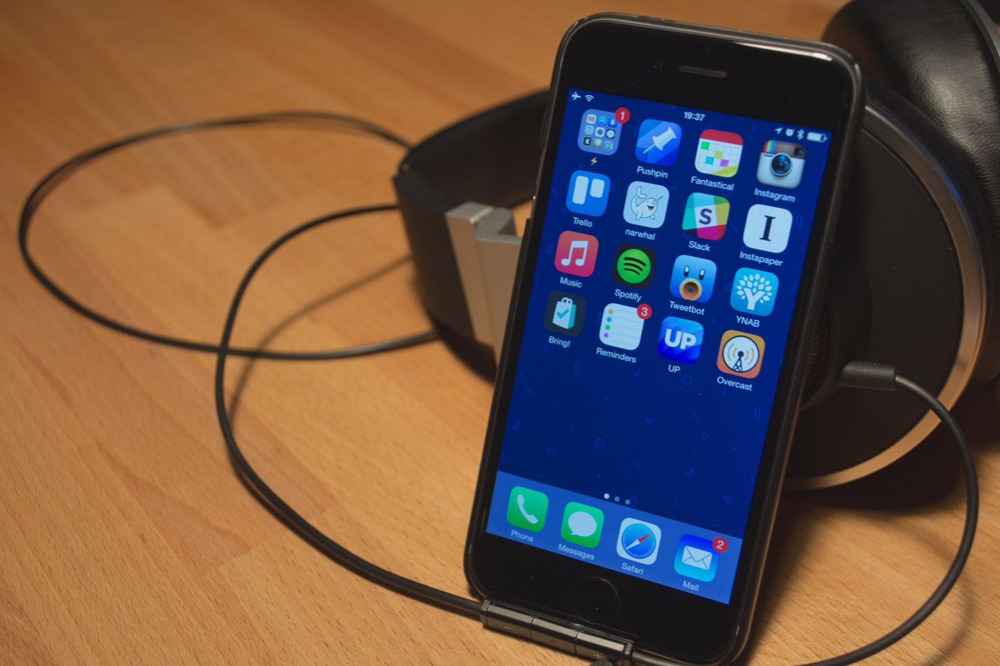

I like when other developers share their knowledge and their setups. Here is my approach to show other developers how I manage my projects as of March 2015.

<figure>
    
    <figcaption>My setup when I'm working at home.</figcaption>
</figure>

## Hardware

### Macbook Pro Retina 13" late 2013
My first Mac. And I don't regret buying it. Even though I should have have invested into more memory (you can never have enough memory!), but it stills works great for me. I plan to reinstall Yosemite, because in the early days I messed up with some CLI tools and I'm to lazy to revert those mistakes. I will also try to get Bootcamp installed, so I can trash my old Windows Notebook.

[apple.com/macbook-pro](http://www.apple.com/macbook-pro/)

### iPhone 6, 64GB spacegray
My third iPhone. My most important device I always have on me, even though the usage of the phone dropped in the last months. My daily commute to work doesn't take up so long anymore and I removed a lot of unused apps and services which distracted me most of the time.     

<figure>
    
    <figcaption>Current homescreen arrangement. I try to keep the numbers of apps as low as possible.</figcaption>
</figure>

----

## Mac Apps

#### Alfred
If you haven't heard of Alfred yet, give it a try. Its my favorite app launcher since day one of my Mac era. I use it many times a day and it improves my productivy tremendously. See the *Workflow* Section for more information about Alfred.

[alfredapp.com](http://www.alfredapp.com/)

#### Sublime Text
When I first started programming many years ago Notepad++ was the go to editor of my choice. Thankfully times changed and I invested into Sublime Text 3. It's fast, it's extendable and I can configure[^1] it like I want.

[sublimetext.com](http://sublimetext.com)

#### Dropbox
I tried them all, but Dropbox remains the best sync service for my usage. I keep all my app settings in a "sync"-folder which is symlinked to various locations through out the OS.

#### Chrome
I'm really in love with the dev tools of Chrome. It's just so easy to debug your website with all the various plugins and built in features. Sadly Chrome is extremly energy hungry and I use it only when im hooked to an energy plug.
I also try to keep the number of extensions as low as possible, but I don't want to miss the following:

- [JSON Formatter](https://github.com/callumlocke/json-formatter)
- [Postman REST Client](https://chrome.google.com/webstore/detail/fdmmgilgnpjigdojojpjoooidkmcomcm)

#### Safari
Since Yosemite my browser of choice when I'm not developing. Insanly fast and you have the feeling the browser doesn't need any battery at all.

#### Tower
Yeah, I'm one of those guys which don't use Git in the command line (I hope I learn it some day). Tower 2 is the Best Git client if you have to switch between many projects a day. It's fast, simple to use and helps you out if you have some merge conflicts.

[git-tower.com](http://www.git-tower.com/)

#### Dash
No one can keep all functions and commands of a particular system, library or language in his head. If you don't have access to the internet Dash is here to help you.      
You can download the documentation of many libraries and programming languages to your local disk and thanks to some great Alfred Workflows[^2] the solution to your problem is just a key stroke away.

[kapeli.com/dash](http://kapeli.com/dash)

#### Simplenote
A simple app to collect notes and ideas. Evernote got too bloated with features I don't want to use (Hello "Work Chat"). Simplenote does one job and it does it well.

[simplenote.com](http://simplenote.com)

#### Sketch
I never liked Photoshop. It's to clunky for my work and I don't want to invest hundres of hours just to build an interface for my next project.   
I switched to Sketch after the release of version 3 last year and I like the speed of the app.
The plugin system is also a great feature. I recommend installing [Sketch Toolbox](http://sketchtoolbox.com/) to easly install and discover new plugins.

[bohemiancoding.com/sketch](http://bohemiancoding.com/sketch)

#### Flux
The first time I used Flux I didn't get it. Why should an App change the colors of my display, relative to the current time? But after I spend some hours working in the evening I don't want to miss this simple app!

[justgetflux.com](https://justgetflux.com/)

#### Dropshare
From time to time I have to share a screenshot, file or a quick video with my teammates. With Dropshare I can use my own server as storage node. With some Magic[^3] all files older than a few hours are deleted from my server.    
I also made a simple [landingpage template](https://github.com/stefanzweifel/dropshare-landingpage) you can use.

[getdropsha.re](https://getdropsha.re/)

#### Tweetbot
Twitter Client of choice. Helps me to stay up to date with the rest of the world.

#### iTunes
Keeper of my old music albums I digitalized many years ago. Thanks to iTunes Match I don't have to have all songs on my local disk and I can download songs right onto my iPhone.     
I can't remember when I hooked up the iPhone the last time to sync something.

-----

## iPhone Apps
Most of the apps installed on my mobile device are just the counterpart of their desktop sibling, but here are some apps I really don't want to miss, even though there are not really development related

#### YNAB (You need a budget)
I moved out last year and I had to learn to manage my income and savings. YNAB helps me to see were my money goes and on which category I can spend my money next month.

[ynab.com](http://ynab.com)

#### Pushpin
A good Pinboard Client.

[iTunes link](https://itunes.apple.com/us/app/pushpin-for-pinboard/id548052590?mt=8)

#### narwhal (Reddit Client)
Easy to use Reddit Client.

[iTunes link](https://www.google.ch/url?sa=t&rct=j&q=&esrc=s&source=web&cd=6&cad=rja&uact=8&ved=0CDQQFjAF&url=https%3A%2F%2Fitunes.apple.com%2Fus%2Fapp%2Fnarwhal-for-reddit%2Fid845422455%3Fmt%3D8&ei=FIHvVKXqJ5TsaNrJgZgK&usg=AFQjCNHkr0r6Ng5-YLDgK-64AYvdk083ag&sig2=A-1lH2wlhfpwwdlW458ZVQ&bvm=bv.86956481,d.bGQ)

#### Reeder
I still read some RSS feeds but I try to keep them to a minimum. Reeder is a well designed RSS client for iOS and Mac. You can also pipe your read articles to other services like Pinboard or Pocket.

[reederapp.com](http://reederapp.com/ios/)

## Workflows
As I mentioned earlier I'm an Alfred power user. Everytime I repeatedly do a task and I think I can automate it, I write an Alfred shortcut / workflow for that. 
Here are some selected workflows I often use:

- [Open a project in Sublime](https://github.com/franzheidl/alfred-workflows/tree/master/open-with-sublime-text-2)
- [Search through Sketch Files](https://github.com/stefanzweifel/alfred-workflows/tree/master/open-in-sketch)
- [Kill a process](https://github.com/ngreenstein/alfred-process-killer)
- [Import Jawbone UP data into Day One](/posts/jawbone-up-to-dayone/)
- Create a new ngrok instance
- Wake up my NAS
- Tweet a GIF
- Open a project on Github / Springloops and deploy it to a server
- Create and bootstrap a new AngularJS / Laravel / x application
- ...

I'm also a big fan of Javascript task runners (Gulp and Grunt). I will write more about my used plugins and how we use Grunt in our team in the near future.

## Services
I try to keep the numbers of services as low as possible. If I don't use a service more than once 1 month, it gets removed.

### Trello
We use Trello at work to organize our projects. Before Trello we used a bloated ticket-system but since we moved away from that our productiviy went trough the roof.
I use it also to organize my side projects. If an idea pops into my head I just open the app and add a card for that.

[trello.com](http://trello.com)

### ngrok
Sometimes I have to share my local development environment with a client or a colleague. Thanks to ngrok I can start a password protected VPN tunnel and can share the URL with anyone.      
It's free to use and you can even selfhost it.

[ngrok.com](https://ngrok.com)

### Pinboard
Simple and robust service to store bookmarks. The registering fee was a bummer first but I was worth every dollar[^4].

[pinboard.in](http://pinboard.in)

### Spotify
Sometimes I can't listen to my iTunes Library anymore. It gets so boring if you hear the same songs for a 1000 times.. So I switch to Spotify and play one of many coding playlists[^5].

[spotify.com](http://spotify.com)

### Slack
Man I love Slack. Sadly my team isn't using it yet (I hope I can convince them to switch :)). But I use it for personal projects and to keep in touch with the [Laravel Community](http://larachat.co).

[slack.com](http://slack.com)

### Github

> Sharing is caring.

Every day I learning something new from the developer community and thanks to Github, it's easy to give something of that knowledge back.     
Since I have to switch between different "Git-Services" I really appreciate the work the designers at Github put into their product. Every page you use in your day to day workflow is so easy to use.

[github.com](http://github.com)

### Rescuetime
Newest member to the services family. I try to keep numbers of anything I do. Steps and sleeping hours, time spent on projects and now also time spent on everything I do at my computer.     

[rescuetime.com](https://www.rescuetime.com)

----

If you got so far, thanks for reading this post. I still didn't covered every single application, plugin, extension or script I use on a daily basis.          
If you have any questions or want to know more about my setup / workflow, feel free to ask on [Twitter](http://twitter.com/_stefanzweifel) or by [email (mailto-Link)](mailto:hello@stefanzweifel.io).

[^1]: I shared my settings.json on [Github](https://gist.github.com/stefanzweifel/9397728). I also wrote a dedicated [blog post (GERMAN)](/posts/sublime-text/) some time ago.
[^2]: [Alfred Dash Workflow on Github](https://github.com/willfarrell/alfred-dash-workflow).
[^3]: [clearSharingFolder.sh](https://github.com/stefanzweifel/uberspaceScripts/blob/master/bin/clearSharingFolder.sh)
[^4]: As of January 1th 2015 the pricing policy [changed](https://blog.pinboard.in/2014/11/new_pricing_policy/).
[^5]: [Personal list (~20 hours)](http://open.spotify.com/user/117030804/playlist/7v9dSkEBOCPiNKd5iDE9hm), [Coding Programming (~45 hours)](http://open.spotify.com/user/125937873/playlist/5SgJR30RfzR5hO21TsQhBp), [Music for Programming (~15hours)](http://open.spotify.com/user/mrkscslr/playlist/15HDfpQeLDIuA39lY2i5Wu)