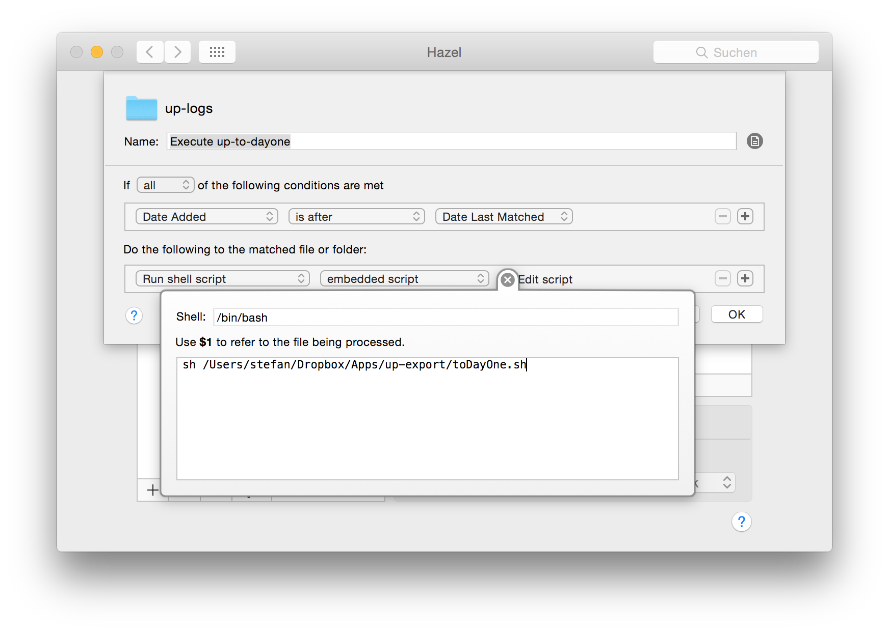

Some weeks ago I published [a post](https://stefanzweifel.io/posts/jawbone-up-to-dayone/) on how to store your Jawbone UP data into DayOne.app. The script got quite popular and many people reached out to me with questions and smaller problems.

Today I want to show you how you can automate the execution of the script with [Hazel.app](http://www.noodlesoft.com/hazel.php). The app isn't free but has a 14 day trial. Just download it and try it out.

## Setup

Open the Hazel preference panel and add your `up-logs` folder to the folders list. (The `up-logs` folder should be in your Dropbox folder `~/Users/$username/Apps/up-export/up-logs`).

Create a new rule and add the following filter: Date added - is after - Date Last Matched.    As soon as new file is placed in your `up-logs` folder Hazel will be triggered.

Now we configure the following action: Run shell script - embedded script. Then click on the little "i"-button next to "Edit script". Shell should be `/bin/bash` or `/usr/local/bin/bash`. The script which should be executed is:

```
sh /Users/$username/Dropbox/Apps/up-export/toDayOne.sh
```

Just replace `$username` with your Mac OS X username or adjust your path so that the file `toDayOne.sh` will be found by Hazel. 
The rule should look like my rule in the picture below.

<figure>
    
    <figcaption>Hazel rule to execute the toDayOne.sh script as soon a new file is added to your Dropbox folder.</figcaption>
</figure>

## It doesnt'work

As always I'm happy to help you out. Just send me a message by <a href="mailto:{{ site.data.urls.email}}">email</a> or create a new [issue on Github](//github.com/stefanzweifel/up-to-dayone/issues/new).

