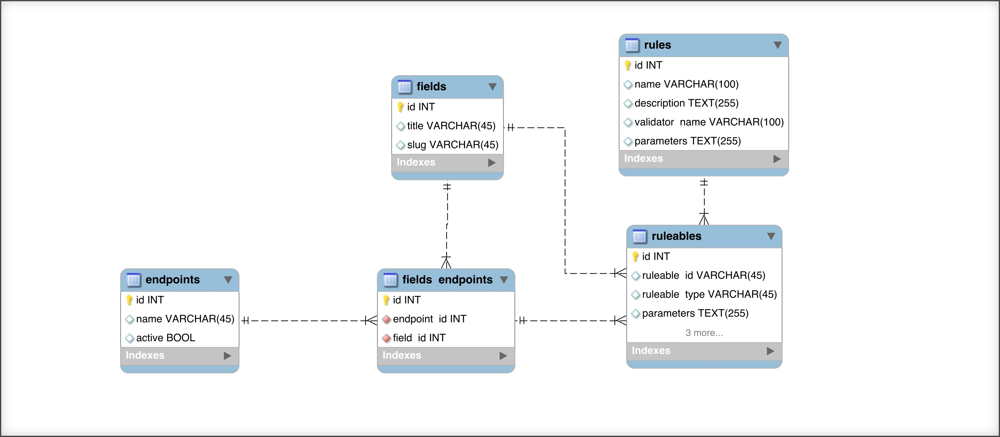

In this blog post I would like to introduce you to some advanced techniques to Laravels / Eloquents Relationship model. The most common usecases for Relationships are already well [documented](https://laravel.com/docs/5.2/eloquent-relationships). I assume you know something about PHP, Laravel and Eloquent Relationships.

The code for this article is available in [this demo project](https://github.com/stefanzweifel/example-advanced-eloquent-with-pivot) on Github.

## Requirements

The following use case is straight from a real word application I worked on in the last months. 
Let's imagine you want to provide a way to write data into your database through an API for your customers. The data-source are simple HTML forms, but the structure of those forms changes depending on the page they are displayed. Maybe there's a form to hire a lawyer, one to search the best mortgage or you want an offer for a painter. Because we didn't want to code every API endpoint over and over again, we created a system where we can "build" our API with a drag & drop interface.

Below are the simplified requirements (I just want to cover the important stuff for this article):

<figure>
    
    <figcaption>Database Schema for this example</figcaption>
</figure>


### Rule

- Represent validation rules which are applied to `Field` (A default set of Rules wich are always applied; eg. field "email" should always be validated as an email) or to `FieldEndpoint` (Attach a Rule when you build your API)
- `Rule` morphedByMany `Field`
- `Rule` morphedByMany `FieldEndpoint` (That's the Pivot Table!)

### Field

- Represents a single HTML field; "firstname", "street", "email"
- `Field` belongsToMany `Endpoint`
- `Field` morphToMany `Rule`

### Endpoint

- Represents a single API endpoint ("hire-painter", "hire-lawyer", etc.)
- `Endpoint` hasMany `Field`

### FieldEndpoint

- Represents the Pivot table (the connection) between a single `Field` and a single `Endpoint`
- `FieldEndpoint` morphToMany `Rule`

## The Migrations

Next we need the database tables. Because they're quite easy I just link them here. The most important part is, that our pivot table has an `id` column.

- [Migration for rules](https://github.com/stefanzweifel/example-advanced-eloquent-with-pivot/blob/master/database/migrations/2016_01_16_175254_create_rules_table.php)
- [Migration for fields](https://github.com/stefanzweifel/example-advanced-eloquent-with-pivot/blob/master/database/migrations/2016_01_16_175312_create_fields_table.php)
- [Migration for endpoints](https://github.com/stefanzweifel/example-advanced-eloquent-with-pivot/blob/master/database/migrations/2016_01_16_175246_create_endpoints_table.php)
- [Migration for fields_endpoints](https://github.com/stefanzweifel/example-advanced-eloquent-with-pivot/blob/master/database/migrations/2016_01_16_183742_create_fields_endpoints_table.php)
- [Migration for rulables](https://github.com/stefanzweifel/example-advanced-eloquent-with-pivot/blob/master/database/migrations/2016_01_16_183915_create_ruleables_table.php)

## The Models

Let's create our first Model, `Rule`. The `fields` method returns a simple [Many to Many Polymorphic](https://laravel.com/docs/5.2/eloquent-relationships#many-to-many-polymorphic-relations) relationship. Nothing special. The second relationship `fieldEndpoints` is also a "Many to Many Polymorphic" Relationship but instead of a "normal" Model we point to the `FieldEndpoint` Pivot Model.

```php
<?php

namespace App;

use Illuminate\Database\Eloquent\Model;

class Rule extends Model
{
    /**
     * Relationship with the Field model.
     *
     * @return    Illuminate\Database\Eloquent\Relations\MorphToMany
     */
    public function fields()
    {
        return $this->morphedByMany(Field::class, 'ruleable');
    }

    /**
     * Relationship with the FieldEndpoint model.
     *
     * @return    Illuminate\Database\Eloquent\Relations\MorphToMany
     */
    public function fieldEndpoints()
    {
        return $this->morphedByMany(FieldEndpoint::class, 'ruleable');
    }
}

```

Next we create our `Field` Model. Here we have a simple "Belongs to Many" Relationship called `endpoints`. It is important you add the `->withPivot(["id"])` statement here.
We also have the counterpart to the polymorphic relationship of the `Rule` model.
And then there's something new. We override the `newPivot` method and check if the passed `$parent` variable is an instance of `Endpoint`, if this is true we create a new instance of the `FieldEndpoint` model. This if-clause is resolved, when we access the `endpoint`-Relationship.

```php
<?php

namespace App;

use Illuminate\Database\Eloquent\Model;

class Field extends Model
{
    /**
     * Relationship with the Endpoint model.
     *
     * @return    Illuminate\Database\Eloquent\Relations\BelongsToMany
     */
    public function endpoints()
    {
        return $this->belongsToMany(Endpoint::class)->withPivot(['id']);
    }

    /**
     * Relationship with the Rule model.
     *
     * @return    Illuminate\Database\Eloquent\Relations\MorphToMany
     */
    public function rules()
    {
        return $this->morphToMany(Rule::class, 'ruleable');
    }

    public function newPivot(Model $parent, array $attributes, $table, $exists)
    {
        if ($parent instanceof Endpoint) {
            return new FieldEndpoint($parent, $attributes, $table, $exists);
        }

        return parent::newPivot($parent, $attributes, $table, $exists);
    }
}
```

Next we create the `Endpoint` Model. It's quite similar to the `Field` Model. We also have a "Belongs To Many" Relationship called `fields` (don't forget the `withPivot`-Statement) and we also override the `newPivot` method. This time, we check if the passed `$parent` variable is an instance of the `Field` Model.

```php
<?php

namespace App;

use Illuminate\Database\Eloquent\Model;

class Endpoint extends Model
{
    /**
     * Relationship with the Field model.
     *
     * @return    Illuminate\Database\Eloquent\Relations\BelongsToMany
     */
    public function fields()
    {
        return $this->belongsToMany(Field::class, 'fields_endpoints')->withPivot(['id']);
    }

    public function newPivot(Model $parent, array $attributes, $table, $exists)
    {
        if ($parent instanceof Field) {
            return new FieldEndpoint($parent, $attributes, $table, $exists);
        }

        return parent::newPivot($parent, $attributes, $table, $exists);
    }
}

```

Finally we create our Pivot-Model `FieldEndpoint`. Because this is not a normal Model the class extends the `Pivot` class rather than the `Model` class.
Thanks to the previously overwritten `newPivot` methods, this Model is now initiated everytime we access the "Belongs to Many" Relationships. 

Now we can add our final Relationship to this Model. It is another "Many to Many Polymorphic" Relationship called `rules`. Thanks to this, we can attach a `Rule` to the connection between `Endpoint` and `Field`

```php
<?php

namespace App;

use Illuminate\Database\Eloquent\Relations\Pivot;

class FieldEndpoint extends Pivot
{
    /**
     * Relationship with the Rule model.
     *
     * @return    Illuminate\Database\Eloquent\Relations\MorphToMany
     */
    public function rules()
    {
        return $this->morphToMany(Rule::class, 'ruleable')->withPivot('parameters');
        ;
    }
}
```

## Usage

The hard work is done. Our Relationships are all setup and now we can start using it in our code. I won't cover, how you create a userfriendly interface for this usecase, but rather how you would attach and access the Models. You find more examples in [this test](https://github.com/stefanzweifel/example-advanced-eloquent-with-pivot/blob/master/tests/RelationshipTest.php).

I annotated the test with some comments, which should explain the workflow for this Relationship system.

```php
<?php

use App\Endpoint;
use App\Field;
use App\Rule;
use Illuminate\Foundation\Testing\DatabaseMigrations;
use Illuminate\Foundation\Testing\DatabaseTransactions;
use Illuminate\Foundation\Testing\WithoutMiddleware;

class RelationshipTest extends TestCase
{
    public function an_endpoint_can_have_many_fields_and_this_connection_can_have_many_rules()
    {
        // A Field may have a default set of Rules, which are always applied
        $fieldRules = factory(Rule::class, 2)->create();
        $field      = factory(Field::class)->create();
        $endpoint   = factory(Endpoint::class)->create();

        // Attach default Rules to Field
        $field->rules()->sync($fieldRules);

        // Attach Field with default set of Rules to Endpoint
        $endpoint->fields()->attach($field);

        // Create 5 new Rules which will be stored to the pivot table Model
        $fieldEndpointRules = factory(Rule::class, 5)->create();

        /**
         * This is the "not so nice part". We have to receive the Pivot Model,
         * which connects Endpoint and Fields. In this example we only have
         * one Field which connects with the Endpoint, so we can simply
         * call `first()`. In your implementation you would have to
         * do `whereName($field->name)` or something similar.
         */
        $pivotModel = $endpoint->fields()->first()->pivot;

        // Attach Rules to the Pivot Model
        $pivotModel->rules()->sync($fieldEndpointRules);

        $this->assertCount(2, $field->rules);
        $this->assertCount(1, $endpoint->fields);
        $this->assertCount(5, $endpoint->fields()->first()->pivot->rules);
    }
}
```

As you can imageine there are thousands of ways on how you can use this in your application. If you have any questions about this post or want to chat about Laravel im also available on [http://larachat.co](http://larachat.co).
