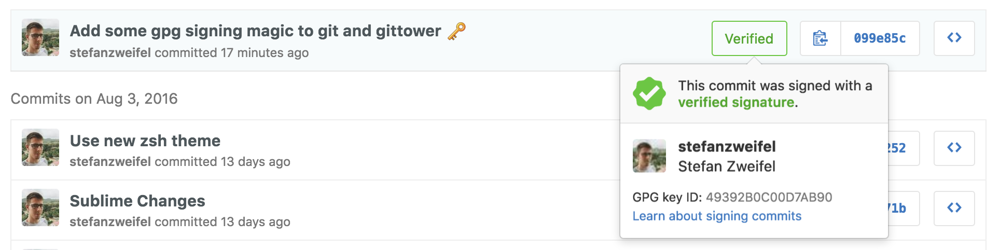

Today Github's weekly newsletter brought me [this](https://github.com/pstadler/keybase-gpg-github) handy Guide about GPG signing, git and Github. I tried setting everything up after Github released [the feature](https://github.com/blog/2144-gpg-signature-verification) back in April 2016, but I couldn't get it to work with Tower, because Tower doesn't officially support it.

<blockquote class="twitter-tweet" data-conversation="none" data-lang="en"><p lang="en" dir="ltr"><a href="https://twitter.com/dmilith">@dmilith</a> Currently, support for PGP signing is not planned. Although I wouldn&#39;t say &quot;never&quot;...</p>&mdash; Tower (@gittower) <a href="https://twitter.com/gittower/status/428576001246134272">January 29, 2014</a></blockquote>
<script async src="//platform.twitter.com/widgets.js" charset="utf-8"></script>


After some research and tinkering I found a working solution for me. Here's how I've done it:

## 1. Follow @pstadlers [Guide](https://github.com/pstadler/keybase-gpg-github)

Just follow Patrick's guide step by step. I would also recommend to do the extra work and complete the optional steps for a password-less process.

## 2. Create a GPG wrapper command

Create a new executable file here `/usr/local/bin/gpg_wrap`. It will contain the following code:

```shell
#!/bin/sh

/usr/local/bin/gpg --batch $*
```

> Thanks to [@dmilith on Twitter](https://twitter.com/dmilith/status/719457497053061121) for the idea!

## 3. Update your `.gitconfig`

Add the following line to your `.gitconfig`:

```config
[gpg]
    program = /usr/local/bin/gpg_wrap
```

That's it! Now you should be able to sign your Git commits with your selected GPG key without leaving Tower!


<figure>
    <a href="images/screenshot.png">
          
    </a>   
</figure>