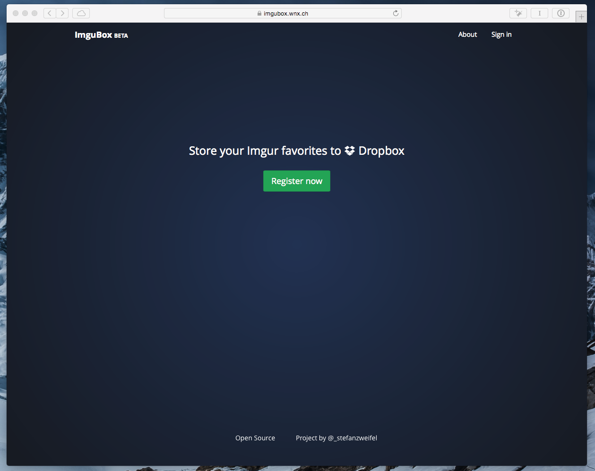
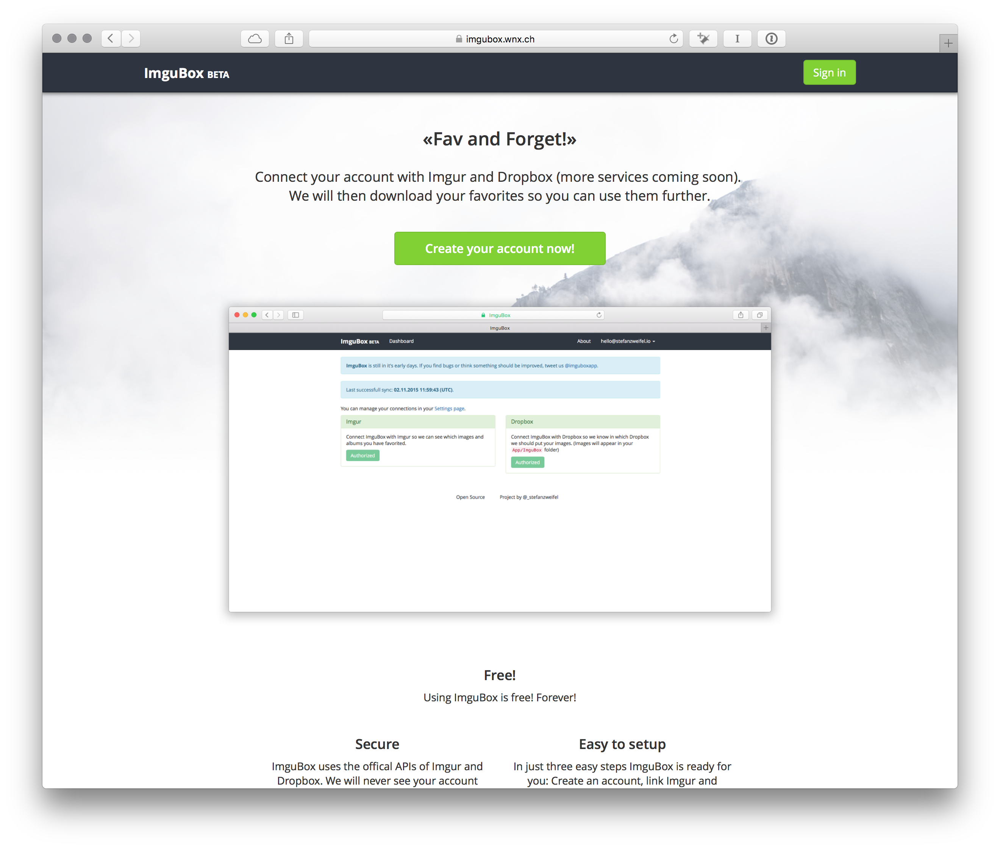
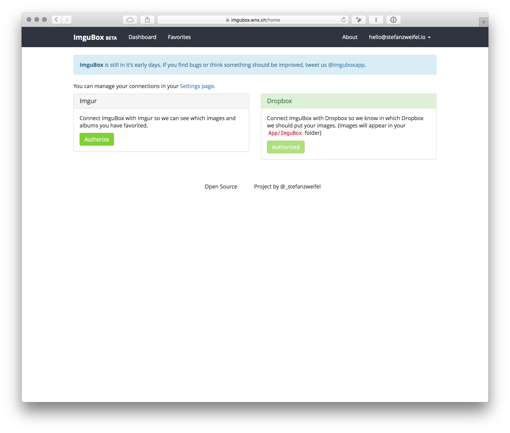
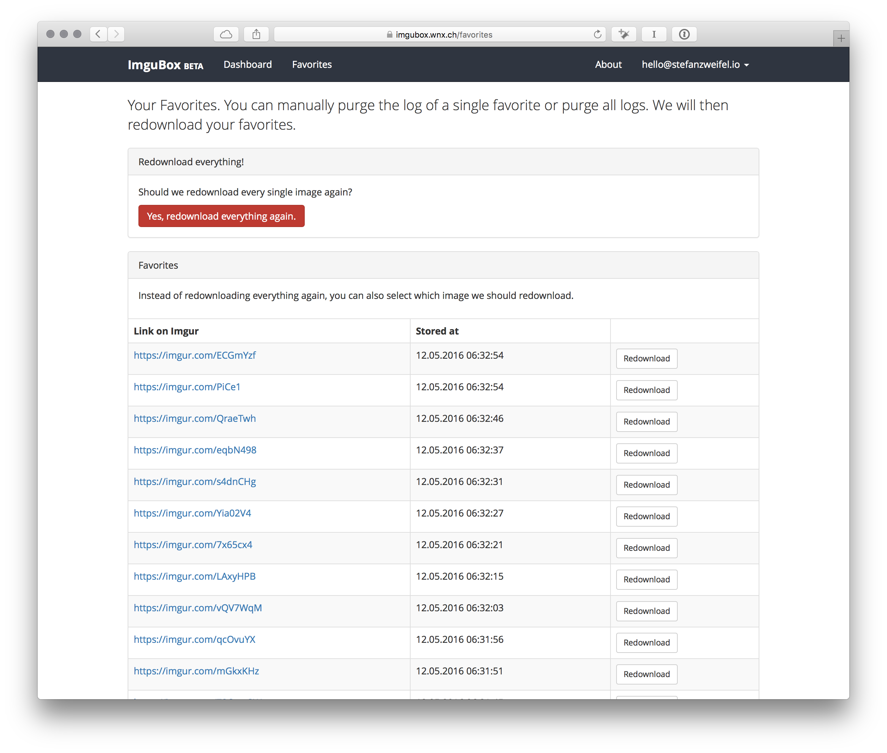
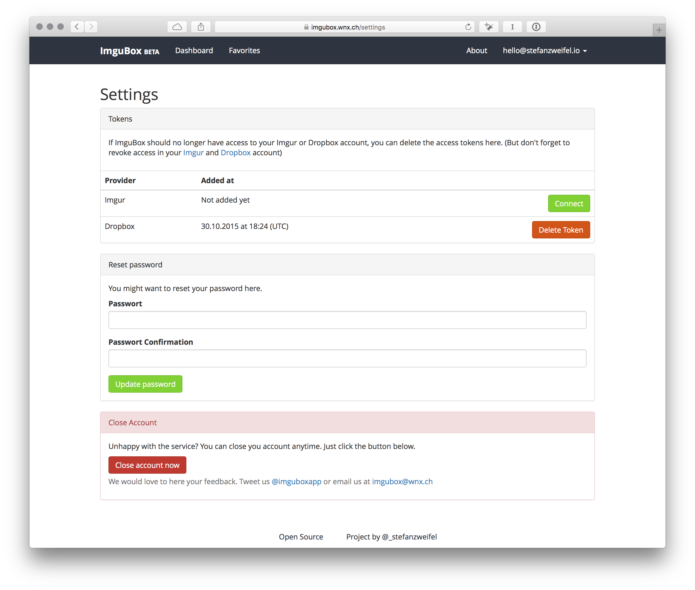

> ImguBox connects Imgur with Dropbox and syncs your favorites.

In the early months of 2015 [Imgur](http://imgur.com) released their iOS app. After hours waisted in the endless stream of cat pictures, funny gifs and interesting stories, I thought it would be great to store my favorited albums in Dropbox. Just for convenience.

I often discovered [big albums with wallpapers](http://imgur.com/gallery/sWhDa) or [interesting stuff about food](http://imgur.com/gallery/zP7nZ) which I wanted to store for further usage.
And that's how "ImguBox" was born.

    

With my favorite PHP Framework, [Laravel 5](http://laravel.com) I quickly scaffolded a simple app, where you can sign up for an account and setup your Imgur and Dropbox account. That's it!

## The struggles

The idea sounded pretty simple. Every time a user marks an album as their favorite, the corresponding images and description should be stored in a Dropbox account. Simple, right?.

But there is one small thing which bothered me. The Imgur API returns a collection of albums a user has favorited. So every time ImguBox would to it's Magic&trade;, it would fetch all albums and store it in Dropbox. And that's bad.      
Let's say the app has 100 users. Every user has 100 favorites. If ImguBox fetches those favorites every hour, it has to fetch 10'000 albums (and each album contains maybe 50 images) every hour. For know I've implemented a simple solution. A database records every parsed image for a given user. Now, when we fetch the favorites from Imgur we subtract the already processed albums from the collection and proceed with a much smaller collection.

But now the good news. Imgur is working on webhooks. This could replace the database overhead and the app would be even smaller and simpler.

    <blockquote class="twitter-tweet" lang="en">
<a href="https://twitter.com/_stefanzweifel">@_stefanzweifel</a> On our radar! 🚀
&mdash; Imgur API (@imgurAPI) <a href="https://twitter.com/imgurAPI/status/590281859453493248">April 20, 2015</a></blockquote>
    

   

## What I've learned from this project

- [Push queues](http://laravel.com/docs/5.0/queues#push-queues) are awesome! They let you move time intensive tasks into the background. Due to it's nature, the processing of uploading favorites to Dropbox is time consuming I've used queues to process them asynchronously.    
For like half a year I struggled with understanding how those queues work, what the differences between push and pull is and how I can use them in a project. Now I got the hang of them and I don't want to miss them anymore.
- Integration Tests are great for small projects like this. Thanks to Jeffrey Way from Laracasts, there is a great package for [Laravel](https://github.com/laracasts/integrated). I watched some screencasts, wrote some tests and now I can be certain that the crucial parts of the app work.
- **Don't rush!** I've written the core code of the app in an afternoon. I immediately thought "Okay, let's deploy it. Someone will probably like it.", but then I realized I should do some deeper tests and then all kinds of exceptions where thrown. After a complete rewrite, I was happy with the application and deployed it.
Now the app should handle most common errors well and I will be informed if something goes wrong.

## Open Source

As always, the whole application is free to use and Open Source. You can find the code on [Github](https://github.com/stefanzweifel/imgubox). Feel free to open issues, pull-request or leave some feedback.

~~You can find the live site at [https://imgubox.wnx.ch](https://imgubox.wnx.ch)~~. 

## Shutdown

In July 2016 I decided to shutdown ImguBox. I didn't want to invest time and energy in an application which is dependent on a horrible unstable API. (Imgurs servers seems to be on fire all the time 🔥).
Because I took the application offline, here are some screenshots of the interface.

<figure>
    
    <figcaption>In late 2015 I decided to redesign the marketing page and highlight the features of the application.</figcaption>
</figure>

<figure>
    
    <figcaption>The simple dashboard of everyones ImguBox account. You can quickly authorize Imgur and Dropbox from here.</figcaption>
</figure>

<figure>
    
    <figcaption>Users could inspect and review all fetched favorites. They could also mark single album for redownload.</figcaption>
</figure>

<figure>
    
</figure>