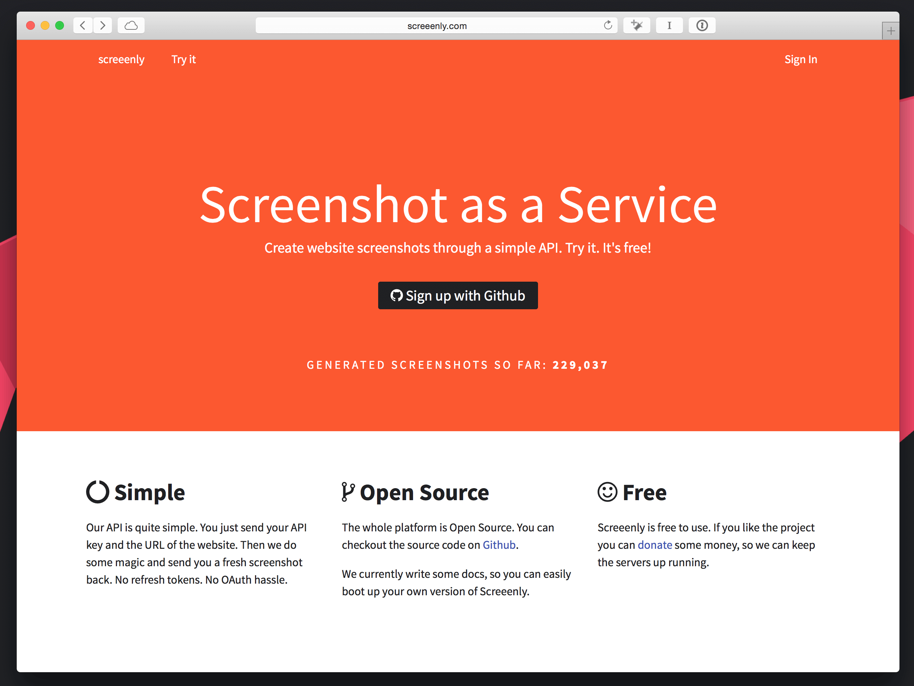

> [Screeenly](http://screeenly.com) is a simple webservice to create screenshots of websites. Checkout the source code on [Github](https://github.com/stefanzweifel/screeenly).

<figure>
    
    <figcaption>Screeenly landingpage as of July 2015.</figcaption> 
</figure>

Ever needed a screenshot of a website in a web application? I needed this feature in another project and I wasn't happy with current solutions on the market. I built a small and simple webservice everyone can use.
Sign up with your Github account and start using the API.

If you don't want to use screeenly.com you could even selfhost the application on your own server. You find the source-code on [Github](https://github.com/stefanzweifel/screeenly).

## Good to know

- Under the hood a Laravel app handles the API requests.
- The screenshots are being created by fireing up a PhantomJS Client
- Images created by screeenly.com are not stored forever on the server. I delete all files older than 12 hours.

## Known issues

You find a list of kown issues on [Github](https://github.com/stefanzweifel/screeenly/issues).