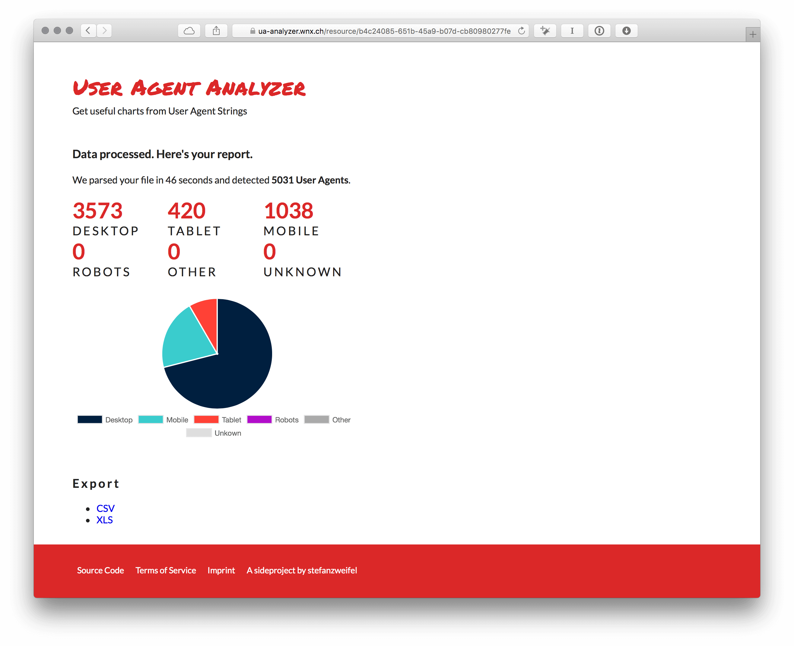

At my current job, I have many tasks. Because we're such a small team, I also create Reports for various "departements" or external clients. Often I have to deal with raw "User Agent Data" and with raw I mean strings like `Mozilla/5.0 (Macintosh; Intel Mac OS X 10_11_4) AppleWebKit/537.36 (KHTML, like Gecko) Chrome/52.0.2729.3 Safari/537.36`. Basically you can't do anything with them. But I always need numbers grouped by device type (mobile, desktop, tablet).

So I build a little [SaaS application](https://ua-analyzer.wnx.ch) which let's me upload raw user-agent strings and parses the data so it's more useful to me.

<figure>
    
    <figcaption>Screenshot of a generated report</figcaption> 
</figure>

## The Backend

The app is powered by Laravel 5 and uses Redis queues to parse the User Agents. It also caches the result of an User Agent to get an extra speed boost.
The User Agents are parsed with the awesome [agent-Package](https://github.com/jenssegers/agent) which uses the [mobileDetect-Package](https://github.com/serbanghita/Mobile-Detect).

The source code is public and open-source on [Github](https://github.com/stefanzweifel/user-agent-analyzer).